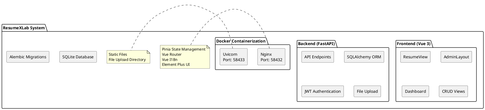
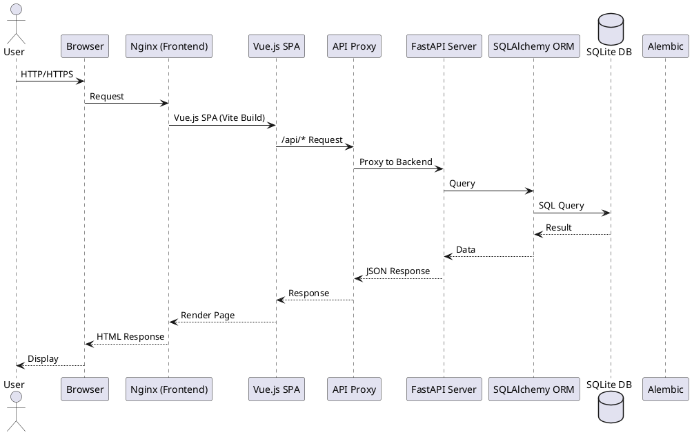
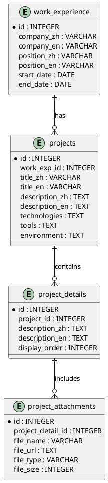
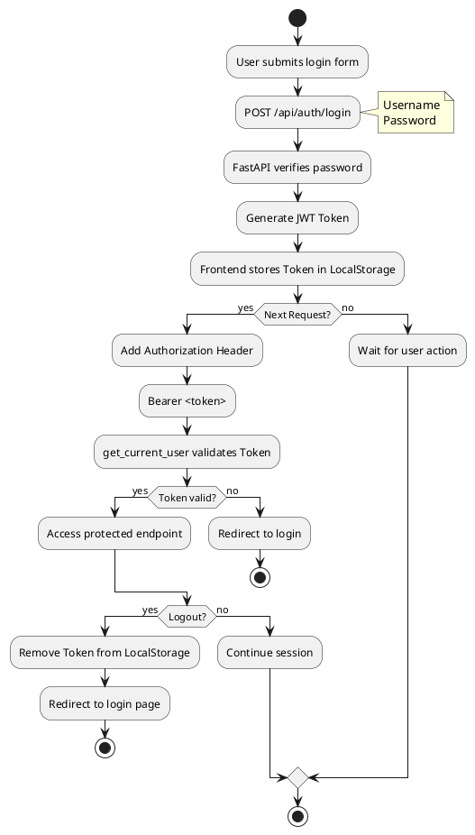
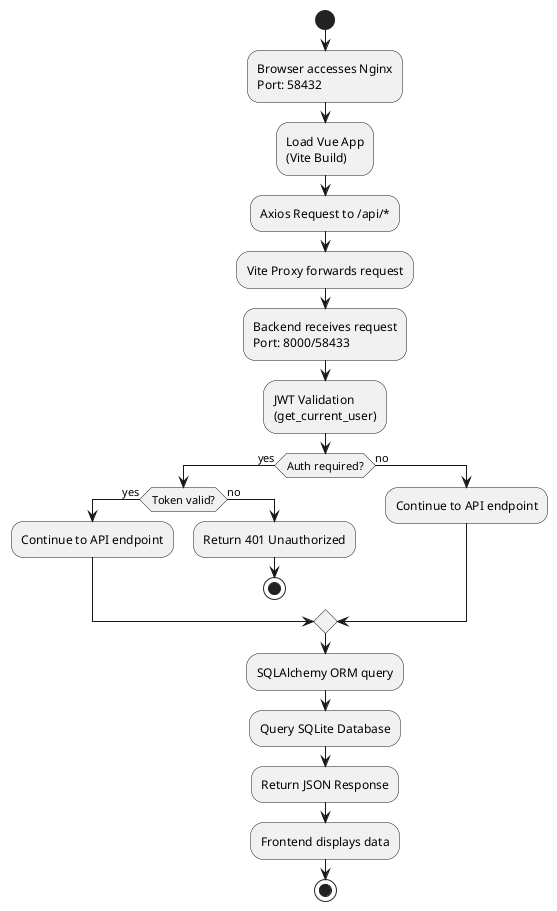
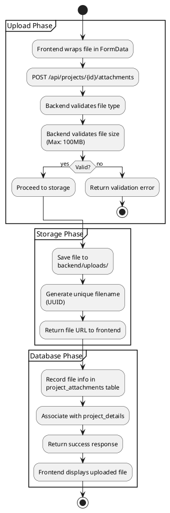

# ResumeXLab 專案架構分析報告

---

## 📋 專案概述

ResumeXLab 是一個全端個人履歷管理系統，採用 Vue 3 前端 + FastAPI 後端架構，支援中英文雙語切換、JWT 身份驗證、完整的 CRUD 功能，並提供 Docker 容器化部署。

### 功能特色

**前台功能 (Public Features)**
- ✅ 專業履歷展示頁面 - 響應式設計，支援各種裝置
- ✅ 中英文雙語切換 - 即時切換語言，Localstorage 記憶偏好
- ✅ 優雅的使用者體驗 - 載入動畫、專案折疊/展開功能
- ✅ SEO 友善 - 優化 meta 標籤與結構化資料

**後台管理 (Admin Features)**
- 🔐 JWT 身份驗證 - 安全的登入系統，Token 24 小時有效
- 📊 Dashboard 儀表板 - 直觀的管理介面
- ✏️ 完整的 CRUD 功能 - 管理所有履歷資料
  - 個人資訊（姓名、聯絡方式、履歷摘要）
  - 工作經歷（公司、職位、專案描述）
  - 專案經驗（技術堆疊、工具、環境）
  - 專案附件管理（檔案上傳與管理）
  - 教育背景（學校、學位、科系）
  - 證照管理（證照名稱、發證機關）
  - 語言能力（語言、熟練度、測驗成績）
  - 學術著作（論文、出版品）
  - GitHub 專案展示
- 📥 批量資料匯入 - 快速匯入履歷資料

**技術優勢 (Technical Highlights)**
- 🐳 Docker 容器化 - 一鍵部署，隔離環境
- 🔄 資料庫遷移 - Alembic 自動化管理
- 📝 自動 API 文件 - Swagger UI / ReDoc
- 🛡️ 安全性防護 - JWT、bcrypt、CORS、XSS 防護
- 📱 響應式設計 - Mobile-first 原則

---

## 🏗️ 系統架構

### 整體架構圖



### 資料流程圖



---

## 🛠️ 技術堆疊

### Frontend（前端技術）

| 技術 | 版本 | 說明 |
|------|------|------|
| **Vue 3** | 3.5.24 | 前端框架 (Composition API) |
| **Pinia** | 3.0.4 | 狀態管理 |
| **Vue Router** | 4.6.3 | 路由管理 |
| **Element Plus** | 2.11.9 | UI 元件庫 |
| **Vue I18n** | 9.14.5 | 多語言支援 |
| **Axios** | 1.13.2 | HTTP 客戶端 |
| **Vite** | 7.2.4 | 建置工具 |
| **DOMPurify** | 3.3.1 | XSS 防護 |
| **@vueup/vue-quill** | 1.2.0 | 富文本編輯器 |
| **Nginx** | latest | 生產環境 Web 伺服器 |

### Backend（後端技術）

| 技術 | 版本 | 說明 |
|------|------|------|
| **FastAPI** | 0.104.1 | Web 框架 |
| **SQLAlchemy** | 2.0.23 | ORM |
| **SQLite** | 3.x | 資料庫 |
| **python-jose** | 3.3.0 | JWT 身份驗證 |
| **passlib[bcrypt]** | 1.7.4 | 密碼加密 |
| **Pydantic** | 2.5.0 | 資料驗證 |
| **Pydantic Settings** | 2.1.0 | 配置管理 |
| **Uvicorn** | 0.24.0 | ASGI 伺服器 |
| **Alembic** | 1.12.1 | 資料庫遷移 |
| **Python** | 3.10+ | 程式語言 |
| **PyPDF2** | 3.0.1 | PDF 處理 |
| **python-multipart** | latest | 檔案上傳支援 |

### DevOps（部署與開發）

| 工具 | 說明 |
|------|------|
| **Docker** | 容器化技術 |
| **Docker Compose** | 多容器編排 |
| **Git** | 版本控制 |
| **uv** | Python 套件管理器 |
| **npm** | Node.js 套件管理器 |

---

## 📁 專案結構

```
ResumexLab/
├── backend/                          # FastAPI 後端應用
│   ├── alembic/                      # 資料庫遷移工具
│   │   ├── versions/                 # 遷移歷史
│   │   │   ├── d711f173f9e3_初始化資料庫表.py
│   │   │   └── ce10aaa23747_添加附件欄位.py
│   │   ├── env.py
│   │   └── script.py.mako
│   ├── app/                          # 應用核心代碼
│   │   ├── api/                      # API 路由
│   │   │   └── endpoints/            # API 端點處理器
│   │   │       ├── auth.py           # 認證登入/登出
│   │   │       ├── personal_info.py  # 個人資訊
│   │   │       ├── work_experience.py # 工作經歷
│   │   │       ├── projects.py       # 專案經驗
│   │   │       ├── education.py      # 教育背景
│   │   │       ├── certifications.py # 證照管理
│   │   │       ├── languages.py      # 語言能力
│   │   │       ├── publications.py   # 學術著作
│   │   │       ├── github_projects.py # GitHub 專案
│   │   │       └── import_data.py    # 批量匯入
│   │   ├── core/                     # 核心配置
│   │   │   ├── config.py             # 應用設置
│   │   │   └── security.py           # 安全相關 (JWT)
│   │   ├── crud/                     # CRUD 操作
│   │   ├── db/                       # 資料庫相關
│   │   │   ├── base.py               # 資料庫基礎設置
│   │   │   └── init_db.py            # 初始化數據庫
│   │   ├── models/                   # SQLAlchemy 模型
│   │   │   ├── user.py               # 使用者模型
│   │   │   ├── personal_info.py      # 個人資訊模型
│   │   │   ├── work_experience.py    # 工作經歷模型
│   │   │   ├── project.py            # 專案模型 (含 details & attachments)
│   │   │   ├── education.py          # 教育背景模型
│   │   │   ├── certification.py      # 證照模型
│   │   │   └── publication.py        # 學術著作模型
│   │   ├── schemas/                  # Pydantic 模式
│   │   │   ├── user.py
│   │   │   ├── personal_info.py
│   │   │   ├── work_experience.py
│   │   │   ├── project.py
│   │   │   ├── education.py
│   │   │   ├── certification.py
│   │   │   ├── language.py
│   │   │   ├── publication.py
│   │   │   └── github_project.py
│   │   └── main.py                   # FastAPI 應用入口
│   ├── data/                         # 資料庫檔案目錄
│   │   └── resume.db                 # SQLite 資料庫
│   ├── uploads/                      # 上傳檔案目錄
│   ├── requirements.txt              # Python 依賴
│   ├── alembic.ini                   # Alembic 配置
│   ├── Dockerfile                    # Docker 映像建置
│   ├── run.py                        # 啟動腳本
│   └── .env.example                  # 環境變數範例
│
├── frontend/                         # Vue 3 前端應用
│   ├── src/
│   │   ├── api/                      # API 服務
│   │   │   ├── auth.js               # 認證 API
│   │   │   └── resume.js             # 履歷資料 API
│   │   ├── assets/                   # 靜態資源
│   │   │   └── css/                  # 樣式檔案
│   │   ├── components/               # Vue 組件
│   │   │   ├── ProjectCard.vue       # 專案卡片組件
│   │   │   ├── ProjectDetails.vue    # 專案細節組件
│   │   │   └── ...
│   │   ├── locales/                  # 多語言翻譯
│   │   │   ├── en.js                 # 英文翻譯
│   │   │   └── zh.js                 # 中文翻譯
│   │   ├── router/                   # 路由配置
│   │   │   └── index.js              # 路由定義
│   │   ├── stores/                   # Pinia 狀態管理
│   │   │   ├── auth.js               # 認證狀態
│   │   │   └── resume.js             # 履歷資料狀態
│   │   ├── utils/                    # 工具函數
│   │   ├── views/                    # 頁面視圖
│   │   │   ├── ResumeView.vue        # 履歷展示頁面
│   │   │   └── admin/                # 管理後台
│   │   │       ├── AdminLayout.vue   # 管理介面佈局
│   │   │       ├── LoginView.vue     # 登入頁面
│   │   │       ├── DashboardView.vue # 儀表板
│   │   │       ├── PersonalInfoEdit.vue  # 個人資訊編輯
│   │   │       ├── WorkExperienceEdit.vue # 工作經歷編輯
│   │   │       ├── ProjectEdit.vue        # 專案編輯
│   │   │       ├── EducationEdit.vue      # 教育背景編輯
│   │   │       ├── CertificationEdit.vue  # 證照編輯
│   │   │       ├── LanguageEdit.vue       # 語言能力編輯
│   │   │       ├── PublicationEdit.vue    # 學術著作編輯
│   │   │       ├── GithubProjectEdit.vue  # GitHub 專案編輯
│   │   │       └── ImportDataView.vue     # 資料匯入
│   │   └── App.vue                   # 應用根組件
│   ├── public/                       # 公共靜態資源
│   │   └── media/                    # 媒體檔案
│   ├── package.json                  # Node.js 依賴
│   ├── vite.config.js                # Vite 配置
│   ├── Dockerfile                    # Docker 映像建置
│   └── nginx.conf                    # Nginx 配置
│
├── scripts/                          # 工具腳本
│   ├── create_database.py            # 資料庫初始化
│   ├── import_resume_data.py         # 批量匯入
│   └── ...
│
├── docs/                             # 文件目錄
│   └── GLM.md                         # 本文件
│
├── docker-compose.yml                 # 生產環境 Docker 配置
├── docker-compose.dev.yml            # 開發環境 Docker 配置
├── .gitignore                        # Git 忽略配置
├── README.md                         # 專案說明
├── CLAUDE.md                         # Claude Code 專案指引
└── .env.example                      # 環境變數範例
```

### 關鍵目錄說明

| 目錄 | 說明 |
|------|------|
| `backend/app/api/endpoints/` | 所有 API 端點實作 |
| `backend/app/models/` | SQLAlchemy 資料庫模型 |
| `backend/app/schemas/` | Pydantic 資料驗證模式 |
| `backend/alembic/versions/` | 資料庫遷移歷史 |
| `frontend/src/views/` | Vue 頁面組件 |
| `frontend/src/stores/` | Pinia 狀態管理 |
| `frontend/src/locales/` | 多語言翻譯檔案 |
| `backend/data/` | SQLite 資料庫檔案 |
| `backend/uploads/` | 上傳檔案儲存目錄 |

---

## 💾 資料結構

### 資料表總覽

| 資料表 | 說明 | 主要欄位 |
|--------|------|----------|
| `users` | 使用者帳號 | id, username, password_hash, email |
| `personal_info` | 個人資訊 | name_zh, name_en, phone, email, address |
| `work_experience` | 工作經歷 | company_zh/en, position_zh/en, start_date, end_date |
| `projects` | 專案經驗 | title_zh/en, description, technologies, tools, environment, attachment_* |
| `project_details` | 專案細節 | project_id, description_zh/en (HTML) |
| `project_attachments` | 專案附件 | project_detail_id, file_name, file_url, file_type |
| `education` | 教育背景 | school_zh/en, degree_zh/en, major_zh/en |
| `certifications` | 證照 | name_zh/en, issuer, issue_date, certificate_number |
| `languages` | 語言能力 | language_zh/en, proficiency_zh/en, test_name, score |
| `publications` | 學術著作 | title, authors, publication, year, pages |
| `github_projects` | GitHub 專案 | name_zh/en, description_zh/en, url |

### 資料表關係



---

## 🔄 資料流程

### 認證流程



1. **使用者登入**
   - 使用者提交登入表單 → `/api/auth/login`
   - FastAPI 驗證密碼 → 生成 JWT Token
   - 前端儲存 Token 於 LocalStorage

2. **後續請求**
   - 前端在請求 Header 加入 `Authorization: Bearer <token>`
   - `get_current_user` 依賴注入驗證 Token
   - Token 驗證成功才允許訪問受保護端點

3. **登出**
   - 前端從 LocalStorage 移除 Token
   - 重新導向至登入頁面

### 資料讀取流程



### 檔案上傳流程



1. **上傳階段**
    - 前端使用 `FormData` 封裝檔案
    - 發送 POST 請求至 `/api/projects/{id}/attachments`
    - 後端驗證檔案類型和大小（最大 100MB）

2. **儲存階段**
    - 檔案儲存於 `backend/uploads/` 目錄
    - 使用 UUID 生成唯一檔案名避免衝突
    - 回傳檔案 URL 供前端顯示

3. **資料庫記錄**
    - 在 `project_attachments` 表記錄檔案資訊
    - 關聯至對應的 `project_details`
    - 支援刪除操作清理不必要的檔案

---

## 📡 API 端點

### 認證 (Authentication)

| 端點 | 方法 | 功能 | 認證 |
|------|------|------|------|
| `/api/auth/login` | POST | 使用者登入 | ❌ |
| `/api/auth/logout` | POST | 使用者登出 | ✅ |
| `/api/auth/verify` | GET | 驗證 Token | ✅ |
| `/api/auth/me` | GET | 獲取當前使用者資訊 | ✅ |

### 個人資訊 (Personal Info)

| 端點 | 方法 | 功能 | 認證 |
|------|------|------|------|
| `/api/personal-info/` | GET | 取得個人資訊 | ❌ |
| `/api/personal-info/` | POST | 新增個人資訊 | ✅ |
| `/api/personal-info/` | PUT | 更新個人資訊 | ✅ |

### 工作經歷 (Work Experience)

| 端點 | 方法 | 功能 | 認證 |
|------|------|------|------|
| `/api/work-experience/` | GET | 取得所有工作經歷 | ❌ |
| `/api/work-experience/` | POST | 新增工作經歷 | ✅ |
| `/api/work-experience/{id}` | GET | 取得特定工作經歷 | ❌ |
| `/api/work-experience/{id}` | PUT | 更新工作經歷 | ✅ |
| `/api/work-experience/{id}` | DELETE | 刪除工作經歷 | ✅ |

### 專案 (Projects)

| 端點 | 方法 | 功能 | 認證 |
|------|------|------|------|
| `/api/projects/` | GET | 取得所有專案 | ❌ |
| `/api/projects/` | POST | 新增專案 | ✅ |
| `/api/projects/{id}` | GET | 取得特定專案 | ❌ |
| `/api/projects/{id}` | PUT | 更新專案 | ✅ |
| `/api/projects/{id}` | DELETE | 刪除專案 | ✅ |
| `/api/projects/{id}/attachments` | GET | 取得專案附件列表 | ❌ |
| `/api/projects/{id}/attachments` | POST | 上傳專案附件 | ✅ |
| `/api/projects/{id}/attachments/{attachment_id}` | DELETE | 刪除專案附件 | ✅ |

### 教育背景 (Education)

| 端點 | 方法 | 功能 | 認證 |
|------|------|------|------|
| `/api/education/` | GET | 取得所有教育背景 | ❌ |
| `/api/education/` | POST | 新增教育背景 | ✅ |
| `/api/education/{id}` | GET | 取得特定教育背景 | ❌ |
| `/api/education/{id}` | PUT | 更新教育背景 | ✅ |
| `/api/education/{id}` | DELETE | 刪除教育背景 | ✅ |

### 證照 (Certifications)

| 端點 | 方法 | 功能 | 認證 |
|------|------|------|------|
| `/api/certifications/` | GET | 取得所有證照 | ❌ |
| `/api/certifications/` | POST | 新增證照 | ✅ |
| `/api/certifications/{id}` | GET | 取得特定證照 | ❌ |
| `/api/certifications/{id}` | PUT | 更新證照 | ✅ |
| `/api/certifications/{id}` | DELETE | 刪除證照 | ✅ |

### 語言能力 (Languages)

| 端點 | 方法 | 功能 | 認證 |
|------|------|------|------|
| `/api/languages/` | GET | 取得所有語言能力 | ❌ |
| `/api/languages/` | POST | 新增語言能力 | ✅ |
| `/api/languages/{id}` | GET | 取得特定語言能力 | ❌ |
| `/api/languages/{id}` | PUT | 更新語言能力 | ✅ |
| `/api/languages/{id}` | DELETE | 刪除語言能力 | ✅ |

### 學術著作 (Publications)

| 端點 | 方法 | 功能 | 認證 |
|------|------|------|------|
| `/api/publications/` | GET | 取得所有學術著作 | ❌ |
| `/api/publications/` | POST | 新增學術著作 | ✅ |
| `/api/publications/{id}` | GET | 取得特定學術著作 | ❌ |
| `/api/publications/{id}` | PUT | 更新學術著作 | ✅ |
| `/api/publications/{id}` | DELETE | 刪除學術著作 | ✅ |

### GitHub專案 (GitHub Projects)

| 端點 | 方法 | 功能 | 認證 |
|------|------|------|------|
| `/api/github-projects/` | GET | 取得所有 GitHub 專案 | ❌ |
| `/api/github-projects/` | POST | 新增 GitHub 專案 | ✅ |
| `/api/github-projects/{id}` | GET | 取得特定 GitHub 專案 | ❌ |
| `/api/github-projects/{id}` | PUT | 更新 GitHub 專案 | ✅ |
| `/api/github-projects/{id}` | DELETE | 刪除 GitHub 專案 | ✅ |

### 資料匯入 (Data Import)

| 端點 | 方法 | 功能 | 認證 |
|------|------|------|------|
| `/api/import/all` | POST | 批量匯入所有履歷資料 | ✅ |
| `/api/import/personal-info` | POST | 匯入個人資訊 | ✅ |
| `/api/import/work-experience` | POST | 匯入工作經歷 | ✅ |
| `/api/import/education` | POST | 匯入教育背景 | ✅ |
| `/api/import/certifications` | POST | 匯入證照資料 | ✅ |
| `/api/import/publications` | POST | 匯入學術著作 | ✅ |

### 工具端點 (Utility Endpoints)

| 端點 | 方法 | 功能 | 認證 |
|------|------|------|------|
| `/` | GET | API 根端點 (歡迎訊息) | ❌ |
| `/health` | GET | 健康檢查 | ❌ |

---

## 🛣️ 前端路由配置

| 路徑 | 組件 | 說明 | 權限 |
|------|------|------|------|
| `/` | ResumeView | 履歷展示頁面 | 公開 |
| `/test-api` | APITestComponent | API 測試組件 | 公開 |
| `/admin/login` | LoginView | 登入頁面 | 公開 |
| `/admin/dashboard` | DashboardView | 管理儀表板 | 需認證 |
| `/admin/personal-info` | PersonalInfoEdit | 個人資訊編輯 | 需認證 |
| `/admin/work-experience` | WorkExperienceEdit | 工作經歷管理 | 需認證 |
| `/admin/projects` | ProjectEdit | 專案管理 | 需認證 |
| `/admin/education` | EducationEdit | 教育背景管理 | 需認證 |
| `/admin/certifications` | CertificationEdit | 證照管理 | 需認證 |
| `/admin/publications` | PublicationEdit | 學術著作管理 | 需認證 |
| `/admin/github-projects` | GithubProjectEdit | GitHub 專案管理 | 需認證 |
| `/admin/import-data` | ImportDataView | 資料匯入 | 需認證 |

### 路由守衛 (Navigation Guard)

```javascript
router.beforeEach((to, from, next) => {
  const authStore = useAuthStore()

  if (to.meta.requiresAuth && !authStore.isAuthenticated) {
    next('/admin/login')
  } else if (to.path === '/admin/login' && authStore.isAuthenticated) {
    next('/admin/dashboard')
  } else {
    next()
  }
})
```

---

## 🚀 安裝及使用方式

### 前置需求

- Python 3.10+
- Node.js 20+
- npm or yarn
- Docker & Docker Compose (可選)
- uv (Python package manager)

---

### 方法一：Docker 部署（推薦）

#### 開發環境 (本地開發)

```bash
# 1. 克隆專案
git clone <repository-url>
cd ResumexLab

# 2. 啟動開發環境
docker-compose -f docker-compose.dev.yml up -d

# 3. 訪問應用
# 前端: http://localhost:8000
# 後端: http://localhost:8001
# API 文件: http://localhost:8001/docs
```

#### 生產環境 (GCP VM / 雲端主機)

```bash
# 1. 克隆專案
git clone <repository-url>
cd ResumexLab

# 2. 啟動生產環境
docker-compose up -d

# 3. 訪問應用
# 前端: http://<YOUR-IP>:58432
# 後端: http://<YOUR-IP>:58433
# API 文件: http://<YOUR-IP>:58433/docs
```

#### Docker 常用指令

```bash
# 查看服務狀態
docker-compose ps

# 查看日誌
docker-compose logs -f

# 停止服務
docker-compose down

# 重啟服務
docker-compose restart

# 重新建置並啟動
docker-compose up -d --build
```

---

### 方法二：手動部署（開發模式）

#### 啟動後端 (Start Backend)

```bash
# 1. 進入後端目錄
cd backend

# 2. 建立虛擬環境
uv venv
source .venv/bin/activate  # macOS/Linux
# OR
.venv\Scripts\activate     # Windows

# 3. 安裝依賴
uv pip install -r requirements.txt

# 4. 初始化資料庫 (首次運行)
python ../scripts/create_database.py

# 5. 啟動伺服器
python run.py
# OR
uvicorn app.main:app --reload --host 0.0.0.0 --port 8000
```

後端將運行在 `http://localhost:8000`
- API 文件: `http://localhost:8000/docs`
- ReDoc: `http://localhost:8000/redoc`

#### 啟動前端 (Start Frontend)

```bash
# 1. 進入前端目錄
cd frontend

# 2. 安裝依賴
npm install

# 3. 啟動開發伺服器
npm run dev
```

前端將運行在 `http://localhost:5173`

---

### 資料庫初始化與遷移

#### 初始化資料庫

```bash
# 首次執行資料庫初始化
uv run python scripts/create_database.py

# 或使用 Python 虛擬環境
cd backend
source .venv/bin/activate
python ../scripts/create_database.py
```

#### 使用 Alembic 進行資料庫遷移

```bash
# 進入後端目錄
cd backend

# 生成遷移腳本
alembic revision --autogenerate -m "migration description"

# 執行遷移
alembic upgrade head

# 查看遷移歷史
alembic history

# 回滾到上一個版本
alembic downgrade -1
```

---

## 🔐 安全性

### JWT 認證機制 (JWT Authentication)

- **演算法**: HS256
- **Token 有效期**: 24 小時 (可配置)
- **儲存方式**: LocalStorage (前端)
- **傳送方式**: Authorization Header (`Bearer <token>`)

```python
# Token 生成範例
SECRET_KEY = secrets.token_urlsafe(32)  # 請在生產環境使用安全的密鑰
ALGORITHM = "HS256"
ACCESS_TOKEN_EXPIRE_MINUTES = 1440  # 24 小時
```

### 密碼安全 (Password Security)

- **加密方式**: bcrypt
- **Salt 輪數**: 預設 12 輪
- **不儲存明文密碼**: 只儲存 bcrypt hash

### CORS 配置 (CORS Configuration)

```python
# 生產環境 CORS 設定
BACKEND_CORS_ORIGINS = [
    "http://localhost:58432",
    "http://localhost:58433",
    "http://localhost:3000",
    "http://localhost:8080",
    "http://localhost",
]
```

### XSS 防護 (XSS Protection)

- 前端使用 DOMPurify 清理 HTML
- 後端驗證所有輸入資料
- 使用 Pydantic 模型驗證

### SQL Injection 防護

- 使用 SQLAlchemy ORM
- 參數化查詢
- 不允許原生 SQL 執行

---

## ⚙️ 環境變數

### Backend (.env)

```env
# API 設定
PROJECT_NAME="Resume Management System"
API_V1_STR=/api
VERSION=1.0.0

# 資料庫設定
DATABASE_URL=sqlite:///./data/resume.db

# JWT 設定
# 請使用以下命令生成安全的 SECRET_KEY：
# python -c "import secrets; print(secrets.token_urlsafe(32))"
SECRET_KEY=PLEASE-GENERATE-A-SECURE-SECRET-KEY-USING-PYTHON-SECRETS
ALGORITHM=HS256
ACCESS_TOKEN_EXPIRE_MINUTES=1440

# CORS 設定
BACKEND_CORS_ORIGINS=["http://localhost:5173","http://localhost:3000","http://localhost:58432"]
```

### Frontend (.env)

```env
VITE_API_BASE_URL=http://localhost:8000/api
VITE_API_BASE_URL_DOCKER=http://localhost:58433/api
```

### Vite Proxy 配置

```javascript
// vite.config.js
server: {
  proxy: {
    '/api': {
      target: 'http://localhost:8000',
      changeOrigin: true,
      secure: false
    },
    '/uploads': {
      target: 'http://localhost:8000',
      changeOrigin: true,
      secure: false
    }
  }
}
```

---

## 🎨 關鍵設計特點

### 1. 雙語支援 (Bilingual Support)

- 所有資料表都有 `_zh` 和 `_en` 欄位
- 前端使用 Vue I18n 進行語言切換
- LocalStorage 記憶使用者語言偏好

### 2. JWT 認證 (JWT Authentication)

- Token 24 小時有效
- 儲存於 LocalStorage
- 透過 Authorization Header 傳送
- 使用依賴注入保護受保護端點

### 3. XSS 防護 (XSS Protection)

- 前端使用 DOMPurify 清理 HTML
- 防止惡意腳本注入
- 支援安全的富文本內容顯示

### 4. 檔案上傳 (File Upload)

- 支援多種格式（PDF, Word, Excel, PowerPoint, 圖片等）
- 最大檔案大小：100MB
- 使用 UUID 生成唯一檔案名
- 檔案儲存於 `backend/uploads/` 目錄

### 5. 富文本編輯 (Rich Text Editing)

- 使用 Vue Quill 編輯器
- 支援 HTML 格式內容
- 前端 DOMPurify 清理確保安全

### 6. 資料庫遷移 (Database Migrations)

- 使用 Alembic 管理版本
- 支援自動生成遷移腳本
- 版本化資料庫結構變更

### 7. Docker 化部署 (Docker Deployment)

- 前端使用 Nginx 服務靜態檔案
- 後端使用 Uvicorn ASGI 伺服器
- 支援生產與開發環境分離
- Volume 掛載確保資料持久化

### 8. API Proxy (API Proxy)

- Vite 自動代理 `/api/*` 到後端
- 簡化前端 API 請求配置
- 避免跨域問題

---

## 📌 重要提示

### 端口配置 (Port Configuration)

| 環境 | 前端端口 | 後端端口 | 說明 |
|------|----------|----------|------|
| **開發環境** | 5173 | 8000 | Vite dev server & Uvicorn |
| **Docker 生產環境** | 58432 | 58433 | Nginx & Uvicorn in Docker |
| **Docker 開發環境** | 8000 | 8001 | Local Docker development |

### 資料庫位置 (Database Location)

- 資料庫檔案位於: `backend/data/resume.db`
- 首次運行需執行: `python scripts/create_database.py` 初始化資料庫
- 建議定期備份資料庫檔案

### 環境變數 (Environment Variables)

- 後端環境變數請參考 `backend/.env.example`
- **重要**: 生產環境務必更改 `SECRET_KEY`
- 使用 `python -c "import secrets; print(secrets.token_urlsafe(32))"` 生成安全密鑰

### 預設登入帳號 (Default Login)

- 使用 `create_database.py` 建立的預設帳號請查看腳本內容
- 建議首次登入後立即更改密碼
- 可透過管理後台新增更多使用者帳號

### 檔案上傳 (File Upload)

- 上傳檔案儲存於: `backend/uploads/`
- 支援的檔案類型取決於配置
- 建議定期清理不必要的附件檔案

---

## 🔧 故障排除

### 常見問題

#### 1. 後端 API 無法訪問

- 檢查 CORS 設定
- 確認前端 API URL 配置正確
- 檢查防火牆規則

#### 2. 前端無法加載圖片

- 檢查 `public/media` 資料夾是否包含圖片
- 確認圖片路徑配置正確
- 檢查 Nginx 靜態檔案配置

#### 3. Docker 容器啟動失敗

- 檢查端口是否被佔用
- 查看容器日誌：`docker-compose logs`
- 確認 Docker 資源是否足夠

#### 4. 資料庫連線失敗

- 確認 `data/` 目錄存在且有寫入權限
- 檢查 SQLite 檔案權限
- 驗證 DATABASE_URL 配置

#### 5. JWT Token 過期

- 重新登入獲取新 Token
- 調整 `ACCESS_TOKEN_EXPIRE_MINUTES` 配置

---

## 📚 開發指南

### 後端開發 (Backend Development)

```bash
# 執行測試
pytest

# 程式碼格式化
black app/
isort app/

# 開發模式啟動
uvicorn app.main:app --reload --host 0.0.0.0 --port 8000

# 資料庫遷移
alembic revision --autogenerate -m "migration message"
alembic upgrade head
```

### 前端開發 (Frontend Development)

```bash
# 建置生產版本
npm run build

# 預覽生產版本
npm run preview

# 開發模式
npm run dev

# 程式碼檢查
npm run lint
```

---

## 📊 相關文件

- [README.md](../README.md) - 專案主要說明文件
- [CLAUDE.md](../CLAUDE.md) - Claude Code 專案指引
- [docs/GITHUB.md](GITHUB.md) - GitHub 相關設定
- [docs/NGINX_TIMEOUT_SETTINGS.md](NGINX_TIMEOUT_SETTINGS.md) - Nginx 設定說明
- [docs/Alembic.md](Alembic.md) - Alembic 資料庫遷移指南
- [scripts/DEPLOYMENT_GUIDE.md](../scripts/DEPLOYMENT_GUIDE.md) - 部署指南
- [docs/DOCKER_COMPOSE_USAGE.md](DOCKER_COMPOSE_USAGE.md) - Docker 使用說明

---

**文件版本**: 1.0
**建立日期**: 2025年1月12日
**最後更新**: 2025年1月12日
**狀態**: Complete ✅

---

## 🙏 致謝

感謝以下開源專案：

- [Vue.js](https://vuejs.org/)
- [FastAPI](https://fastapi.tiangolo.com/)
- [Element Plus](https://element-plus.org/)
- [SQLAlchemy](https://www.sqlalchemy.org/)
- [Docker](https://www.docker.com/)

特別感謝所有貢獻者的大力支持！
